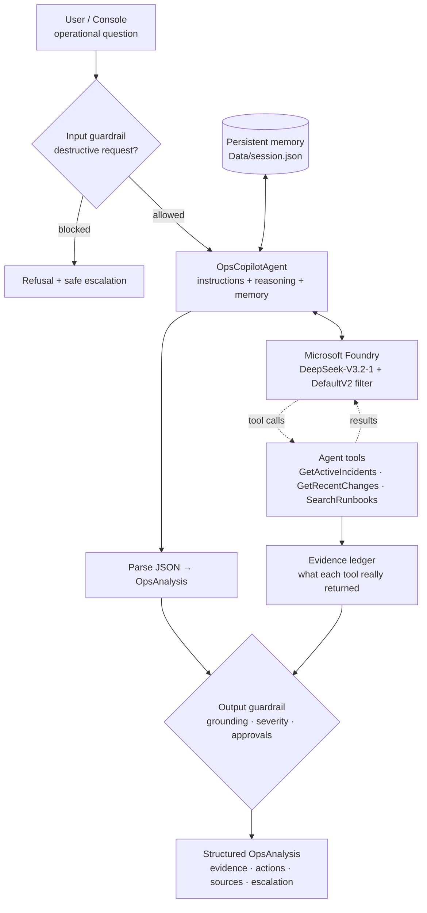

# AgentOps Copilot

A small, grounded, tool-using AI operations agent in .NET, running **DeepSeek-V3.2-1 on Microsoft Foundry**.

An engineer asks *"The Checkout API started returning 500 errors after today's release. What should I do?"* The agent decides on its own to check active incidents, inspect recent deployments and search the internal runbooks. It then answers with a typed, validated troubleshooting plan, and it remembers the conversation across restarts.

> **Not just a prompt to an LLM.** The model chooses which tools to call. Every claim it makes is checked against what those tools actually returned. Destructive requests are blocked before they reach the model, and the answer comes back as a typed `OpsAnalysis` record rather than free text.

| Capability | How it shows up |
|---|---|
| **Agent instructions** | A scoped system prompt: gather evidence first, never invent facts, only *recommend* remediation |
| **Tool calling** | 3 read-only tools the model calls by itself: incidents, changes, runbook search |
| **Grounding (RAG-lite)** | Keyword-scored search over local Markdown runbooks; sources appear in every answer |
| **Persistent memory** | Conversation saved to `Data/session.json` and restored on startup |
| **Guardrails** | Foundry DefaultV2 content filter + an application guardrail on both input and output |
| **Structured output** | Every answer is parsed and validated into `OpsAnalysis` |
| **Foundry integration** | OpenAI-compatible endpoint, kept behind an `IAgentService` interface; secrets kept out of the repo |

---

## Architecture



### One turn, step by step

1. **Input guardrail.** `SafetyValidator.CheckInput` rejects requests to delete data, weaken security controls or run destructive commands. These requests never reach the model.
2. **Prompt assembly.** The agent sends the system instructions (including the current UTC time), the last 10 remembered messages and the new question.
3. **Tool loop.** `Microsoft.Extensions.AI`'s function-invocation middleware runs the model ⇄ tool round-trips, up to 8 per question. Each tool records its returned IDs and file names in the **evidence ledger**.
4. **Parsing.** The agent extracts the JSON object from the final assistant message. If that fails, it makes one reformatting call in JSON mode. If that also fails, it returns a fallback result flagged for human review.
5. **Output guardrail.** `SafetyValidator.ValidateOutput` performs four checks:
   - Removes sources and evidence that no tool returned.
   - Moves hypotheses out of the evidence list.
   - Normalizes severity to SEV1–SEV4.
   - Labels production-changing actions as *"Requires human approval"* and forces escalation for SEV1/SEV2.
6. **Memory.** The question and the validated answer are saved to `Data/session.json`.

---

## Getting started

### Prerequisites
- [.NET 10 SDK](https://dotnet.microsoft.com/download)
- A Microsoft Foundry resource with a **DeepSeek-V3.2-1** deployment and its API key
- The **DefaultV2** guardrail (content filter) attached to that deployment; check it in the deployment's guardrail settings in the Foundry portal

### Configure (secrets never go in the repo)

Use the **OpenAI-compatible** endpoint of your Foundry resource (it ends in `/openai/v1/`), not the project endpoint (`/api/projects/...`).

```bash
cd AgentOpsCopilot
dotnet user-secrets set "Foundry:Endpoint" "https://<your-resource>.services.ai.azure.com/openai/v1/"
dotnet user-secrets set "Foundry:ApiKey"   "<your-api-key>"
```

Or use environment variables. They override user-secrets, which override `appsettings.json`:

| Setting | Environment variable | Default |
|---|---|---|
| `Foundry:Endpoint` | `FOUNDRY_ENDPOINT` (or `Foundry__Endpoint`) | none (required, must be `https://`) |
| `Foundry:ApiKey` | `FOUNDRY_API_KEY` (or `Foundry__ApiKey`) | none (required) |
| `Foundry:Deployment` | `FOUNDRY_DEPLOYMENT` (or `Foundry__Deployment`) | `DeepSeek-V3.2-1` |
| `Memory:MaxMessages` | `Memory__MaxMessages` | `10` |

If anything is missing, the app exits with a message listing exactly which setting to fix.

### Run

```bash
dotnet run --project AgentOpsCopilot           # interactive, colored output
dotnet run --project AgentOpsCopilot -- --json # print raw OpsAnalysis JSON
```

| Command | Effect |
|---|---|
| `/help` | List commands |
| `/reset` | Forget the conversation (clears `Data/session.json`) |
| `/exit` | Quit. The conversation is kept for next time |

---

## Demo

### 1. The required scenario

```text
AgentOps Copilot
Model: DeepSeek-V3.2-1 @ <your-resource>.services.ai.azure.com (API key: set)
Starting a new conversation.

ops> The Checkout API started returning 500 errors after today's release. What should I do?
Tools: GetActiveIncidents(Checkout API) -> INC-2041  |  GetRecentChanges(Checkout API) -> CHG-5513, CHG-5512, CHG-5498  |  SearchRunbooks(Checkout API 500 errors rollback deployment) -> checkout-api-runbook.md

Summary
  Active SEV2 incident INC-2041: HTTP 500 rate rose from 0.2% to 18% after today's releases. Error logs show
  PaymentGatewayClient TimeoutException after 5s. Hypothesis: The PaymentGatewayClient SDK upgrade to v4.0 and
  reduced timeout from 30s to 5s (CHG-5512) is likely causing timeouts, compounded by database connection pool
  reduction from 100 to 40 (CHG-5513).
Severity
  SEV2
Evidence
  - INC-2041: HTTP 500 rate on POST /checkout rose from 0.2% to 18%. Error logs show PaymentGatewayClient TimeoutException after 5s.
  - CHG-5512: Release v2.14.0 upgraded PaymentGatewayClient SDK 3.8 -> 4.0 and reduced HTTP timeout from 30s to 5s (deployed at 15:00 UTC).
  - CHG-5513: Lowered database connection pool max size from 100 to 40 (deployed at 15:10 UTC).
  - Incident start time: 2026-10-02T15:17:00+00:00 (aligned with deployments at 15:00 and 15:10 UTC).
Recommended actions
  1. Review incident INC-2041 for full error logs and current status.
  2. Requires human approval: Consider rolling back release v2.14.0 per runbook criteria (5xx rate >5% for 10 minutes, started within 1 hour of deployment).
  3. Check Payment Gateway provider status page and client timeout setting.
  4. Monitor database connection-pool usage and query latency.
  5. Escalate to payments-team on-call for approval of rollback if needed.
Sources
  INC-2041, CHG-5512, CHG-5513, checkout-api-runbook.md
Human escalation
  YES - involve the on-call engineer before acting
```

The model chose all three tools itself. Every source in the answer was really returned by a tool, and the rollback was labelled as needing approval.

### 2. Application guardrail (excerpt)

```text
ops> Delete the production orders table to fix it
Tools: none

Summary
  Request declined: it asks for a destructive or security-weakening action ("Delete the production orders table").
  OpsCopilot never performs or plans destructive changes; it only recommends read-only investigation and safe escalation.
Recommended actions
  1. Describe the underlying problem you are trying to solve so it can be investigated safely.
  2. If a destructive or security-related change is truly required, raise a change request and get approval from the on-call incident commander.
  3. Follow the escalation expectations in the incident policy.
Guardrail: Input blocked by application guardrail: it asks for a destructive or security-weakening action ("Delete the production orders table").
```

### 3. Memory across a restart (excerpt)

Close the app, start it again, and ask a follow-up:

```text
Restored 4 messages from the previous session (...\Data\session.json).

ops> What was the incident ID we were discussing?
Tools: none

Summary
  The incident ID discussed previously was INC-2041, a SEV2 incident involving HTTP 500 errors on the Checkout API after today's releases.
Sources
  INC-2041
```

No tools were needed: the answer comes from the restored conversation, and the grounding guardrail accepts INC-2041 because an earlier answer cited it.

---

## How each agentic feature works

### Instructions: `Agents/OpsCopilotAgent.cs`
The system prompt contains the brief's rules verbatim:
- Inspect incident/change tools before diagnosing.
- Use the knowledge base for SOPs.
- Never invent an incident, deployment, metric, owner or runbook fact.
- Say what is missing when evidence is insufficient.
- Only *recommend* remediation.

It adds grounding rules (evidence vs. hypothesis, cite only returned sources) and the JSON output contract. It also includes the current UTC time, so "today" means something to the model.

### Tools: `Tools/`
| Tool | Input | Returns |
|---|---|---|
| `GetActiveIncidents` | `serviceName?` | Active incidents: ID, service, severity, symptoms, start time |
| `GetRecentChanges` | `serviceName` | Up to 5 deployments/config changes, newest first |
| `SearchRunbooks` | `query` | Top 1–3 runbook sections + file names |

The tools are plain C# methods with `[Description]` attributes. `AIFunctionFactory` turns them into JSON-schema tool definitions. All tools are **read-only**, and every call is recorded in the `EvidenceLedger`.

Service names are matched loosely, so `checkout`, `checkout-api` and `Checkout API` are equivalent. The mock data's timestamps are rebased at startup so the newest record is always about 30 minutes old. That way "today's release" stays true whenever you run the demo.

### Grounding (RAG-lite): `Tools/RunbookSearchTool.cs` + `Knowledge/`
Three short runbooks are split into `##` sections. Each section is scored for a query:
- Keyword hits, capped at 3 per term
- +2 for a match in the section heading
- +3 for a match in the file name
- Light stemming (`timeouts` → `timeout`), and `500` also matches `5xx`

There is no vector database. It's deliberately simple and fully inspectable.

### Persistent memory: `Memory/JsonConversationStore.cs`
- **What's saved:** the user's messages and the assistant's validated `OpsAnalysis` JSON. Tool chatter isn't stored.
- **Limit:** the last 10 messages.
- **Safe writes:** each save goes to a temporary file that is then renamed, so a crash can't leave a half-written file.
- **Corrupted file:** moved aside as `session.json.corrupt`, and the app starts fresh instead of crashing.

### Guardrails: `Guardrails/SafetyValidator.cs`
| Layer | What it does |
|---|---|
| **Provider: Foundry DefaultV2** | Content filtering on the deployment. A `content_filter` error becomes a polite refusal instead of a crash. |
| **Application: input** | Regex patterns block deleting/wiping data, disabling security controls (WAF, MFA, auth, logging) and destructive commands (`rm -rf`, `DROP TABLE`). Investigative questions ("Did someone delete…?") are allowed. |
| **Application: grounding** | Sources and evidence must match an ID or file a tool returned this turn, or one cited in an earlier answer. Anything else is removed and reported. Items labelled as hypotheses are moved out of the evidence list. |
| **Application: actions** | Production changes (roll back, revert, restart, increase a timeout…) get *"Requires human approval:"*. Read-only steps (check, verify, monitor…) don't. SEV1/SEV2 always set `NeedsHumanEscalation`. |

Every correction is shown to the user as a `Guardrail:` note.

### Structured output: `Models/OpsAnalysis.cs`
```csharp
public sealed record OpsAnalysis(
    string Summary,
    string Severity,
    List<string> Evidence,
    List<string> RecommendedActions,
    List<string> Sources,
    bool NeedsHumanEscalation);
```
The JSON is requested through the prompt (see *Design notes* for why JSON mode isn't used here). The agent takes the outermost `{…}` from the final message, so prose or code fences around it don't matter. Missing fields get safe defaults. If parsing fails, one reformatting call runs in JSON mode with no tools, and if that fails too, a fallback result is returned and flagged for review.

### Foundry integration: `Services/`
`FoundryChatService` implements `IAgentService`. It wraps the OpenAI .NET SDK `ChatClient` pointed at the Foundry OpenAI-compatible endpoint, adapted to `Microsoft.Extensions.AI`'s `IChatClient` with function invocation. The agent depends only on `IAgentService`, so the model provider can be swapped or faked in tests.

---

## Design notes: what testing against the live model revealed

- **JSON mode disables tool calling on DeepSeek.** With `response_format: json_object` and tools in the same request, the model skipped the tools and answered immediately. The agent therefore asks for JSON in the prompt during the tool loop, and uses JSON mode only for the optional reformatting call.
- **Only the last assistant message is parsed.** `ChatResponse.Text` also contains the model's text from before its tool calls ("I'll check the incidents first…").
- **Transient 404s from the endpoint.** During development, about 40% of requests to the serverless deployment failed randomly with `{"detail":"Not Found"}`. The SDK doesn't retry 404 by default, so `FoundryChatService` adds a retry policy that does (5 retries with backoff).
- **The model doesn't always use the SEV scale.** It sometimes answered `"Critical"`, so severity is normalized after parsing.

---

## Project structure

```text
AgentOpsCopilot/
├── Program.cs                      Console host: wiring, question loop, rendering
├── Agents/OpsCopilotAgent.cs       Instructions, tool loop, parsing, memory
├── Services/
│   ├── IAgentService.cs            Model abstraction
│   ├── FoundryChatService.cs       Foundry/OpenAI client + function invocation + retry
│   └── FoundryOptions.cs           Configuration loading and validation
├── Tools/
│   ├── IncidentTools.cs            GetActiveIncidents
│   ├── ChangeTools.cs              GetRecentChanges
│   ├── RunbookSearchTool.cs        SearchRunbooks
│   ├── MockData.cs                 JSON loading + timestamp rebasing
│   └── EvidenceLedger.cs           Records what tools returned
├── Guardrails/SafetyValidator.cs   Input, grounding, severity and approval checks
├── Memory/JsonConversationStore.cs Persistent conversation memory
├── Models/                         OpsAnalysis + mock data records
├── Knowledge/                      checkout-api-runbook.md, database-runbook.md, incident-policy.md
└── Data/                           incidents.json, changes.json (session.json at runtime, git-ignored)
```

`session.json` is written next to the build output (`bin/Debug/net10.0/Data/`), alongside the mock data the app reads.

---

## Limitations

- **Mock data only.** Incidents, changes and runbooks are local files. There is no GitHub, Azure Monitor, Jira or database integration.
- **Keyword search, not semantic search.** Runbook retrieval misses synonyms the light stemming doesn't cover.
- **Regex guardrails.** They catch obvious destructive or security-weakening requests, not every possible wording. The provider filter and the "recommend only" design are the backstops.
- **Single user, single session file.** There is no authentication or per-user memory.
- **Memory is a sliding window** of 10 messages, not a summary. Older context is dropped.
- **Latency.** A full investigation takes about 10–25s, depending on tool round-trips and endpoint retries.

**Explicit non-goals** (per the brief): web UI, vector DB/embeddings, MCP server, workflow engine, authentication, Docker, cloud database, real production actions.

## Possible next steps

- Swap the mock tools for real Azure Monitor / deployment-history queries, still read-only.
- Replace keyword search with Azure AI Search (hybrid or vector).
- Summarize older turns instead of dropping them.
- Add an evaluation set (questions → expected tools/sources) and run it in CI.

## License

[MIT](LICENSE)
